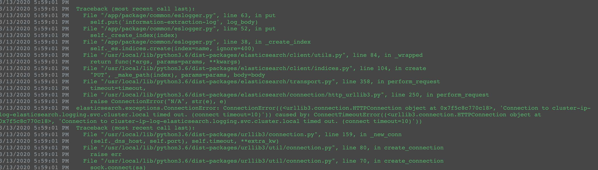

# pwc-ds问题汇总  
## 1.elasticsearch服务连接失败  
客户反馈如下图，显示es服务连接失败  

排查步骤如下：  
1).判断运行es服务的Pod状态是否正常  
>kubectl get pods -n  logging  

经过客户反馈可以看到运行es服务的Pod有很多处于Evicted状态，推测是资源不足导致  

2).查看es服务挂载的磁盘空间是否满载  
>df -TH  

3).查看内存以及cpu资源使用情况  
>free -m  
top

4).经查看发现系统资源充足，推测是Pod内部运行限定使用的内存不足，导致es服务在运行时超出Pod限定使用的内存从而被集群驱逐。此时需要再观察一段时间进行判断，如果仍然出现运行的es的Pod被驱逐的问题则调整Pod的资源使用上限。  
5).删除状态为Evicted的Pod  
>编辑配置文件  
vim /etc/kubernetes/manifests/kube-controller-manager.yaml  
添加以下参数  - --terminated-pod-gc-threshold=1  
重启服务  
systemctl restart kubelet

# 天健项目部署问题汇总
## k8s集群初始化失败
集群初始化时出现下述错误：
[ERROR DirAvailable–var-lib-etcd]: /var/lib/etcd is not empty
原因是由于设备在部署k8s之前已经安装部署了rancher环境，k8s跟rancher都使用etcd键值存储服务去记录设备信息。导致k8s向etcd服务传递设备信息失败。
>解决方法:  
删除etcd的配置文件  
rm -rf /var/lib/etcd 

